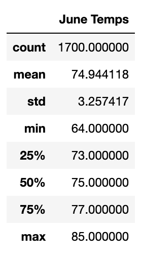
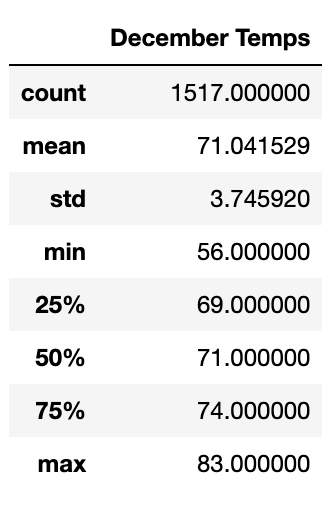
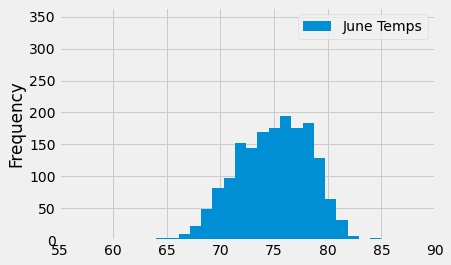
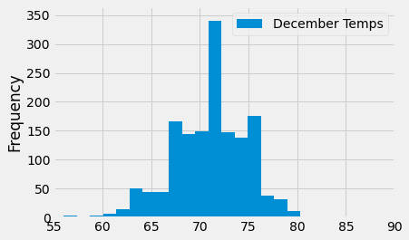
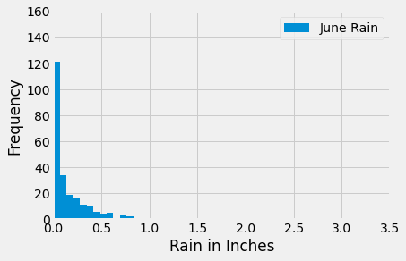
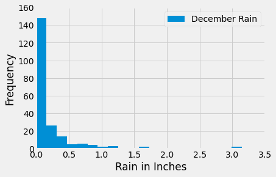

# 09 - Surf's Up!

## Overview
While on vacation in Hawaii last year, I discovered a newfound passion for surfing. To realize my new dream of moving to Hawaii to become a surf bum, I have decided to open a surf and ice cream shop and created a business plan to present to local investor, W. Avy.

W. Avy is on board with the plan, but has requested analysis of weather data in Maui to determine if the surf and ice cream shop business is sustainable year-round.

## Results
### Data Source
[Meteorological Station Waihee, Hawaii](https://geographic.org/global_weather/hawaii/waihee_8375_281.html)  
Meteorological Station ID: USC00519281  
Latitude in decimal degrees: 21.4517  
Longitude in decimal degrees: -157.8489

### Raw Data
#### Temperatures Charted
 

#### Temperatures Graphed
 

### Analysis
* June's average temperature is around 75ºF and the minimum/maximum temperatures only varied +/-10º from the average.
* December's average temperature is around 71ºF and the minimum/maximum temperatures only varied +/-12º from the average.
* Both month's data shows that temperatures remain generally consistent, within a standard deviation averaging 3.5 between the two months. 

## Additional Data
I also wanted to include rain data in my analysis, as this can have a big impact on outdoor activities and tourist activity. 
###  Precipitation
 

After charting the recorded rainfall for June and December, it is clear that there is little to no rain 

## Conclusions
Based on the consistent temperatures and the extremely low rainfall, we can safely conclude that Maui is a fantastic place to open a beach-based business like a surf and ice cream shop. 

The code used for the queries is easily adaptable to pull data for other locations by changing the Meteorological Station ID should we want to franchise and expand our business to other Hawaiian islands.
